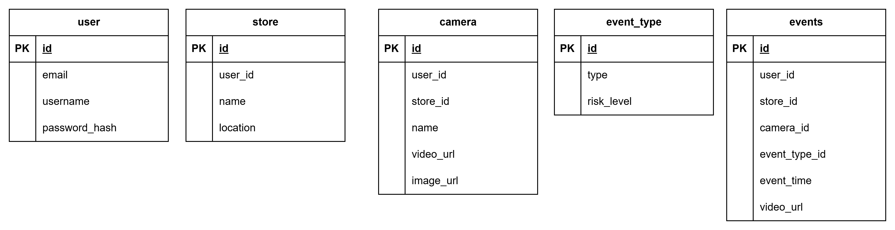

| [English](../README.md) | [Korean](./README/README_ko.md) |

     

</br>

# 🚨 **Smart Unmanned Store: YOLO AI Abnormal Behavior Detection & Alert App**

### Development Timeline

* **Full development period**: 2025.04.29 - 2025.06.19
* **UI Implementation**: 2025.05.02 - 2025.05.15
* **Feature Implementation**: 2025.05.13 - 2025.06.19

</br>

For more details, see the [CCTV\_FE Repository](https://github.com/embedded-final-project-group-A/CCTV_FE).

YOLO-related content is available in the [YOLO Repository](https://github.com/embedded-final-project-group-A/YOLO?tab=readme-ov-file).

</br>

## 1. Project Structure

Here’s the key file structure of the project:

```markdown
📁 CCTV_BE/
├── README.md
├── cctv_system.db                # SQLite DB file (generated by test_db.py)
├── main.py                       # FastAPI main entry
├── requirements.txt              # Python dependencies
├── test_db.py                    # Test DB creation script
├── test_db_android.py            # Android emulator test DB creation
│
├── 📁 dependencies/              # DB & schema logic
│   ├── crud.py                   # CRUD logic
│   ├── db.py                     # DB session connection
│   ├── models.py                 # SQLAlchemy models
│   └── schemas.py                # Pydantic schemas
│
├── 📁 routes/                   # FastAPI endpoints
│   ├── alert.py                 # Alert-related APIs
│   ├── auth.py                  # Signup/Login APIs
│   ├── camera.py                # Camera registration/retrieval
│   ├── store.py                 # Store management
│   └── user.py                  # User profile APIs
│
├── 📁 videos/                   # Sample test videos/images
│   ├── store1_main.mp4
│   └── store1_main.png
│
└── 📁 yolo/                     # YOLO object detection
    ├── best.pt                  # Trained YOLO model
    ├── detect.py                # YOLO detection + clip storage
    └── process_videos.py        # Batch video processing script
```

</br>

## 2. Backend Setup and Execution

### 📁 Project Setup

**Clone the repository**

```bash
git clone https://github.com/embedded-final-project-group-A/CCTV_BE.git
cd CCTV_BE
```

</br>

**Create and activate a virtual environment**

```bash
conda create -n "cctv"
conda activate cctv
pip install -r requirements.txt
```

</br>

### 💽 Database Initialization

* Run `test_db.py` to initialize the database.
* `test_db.py` uses `https://localhost:8000` as the base server address.
* To test on an Android emulator, use `test_db_android.py`.
* If test data is not needed, comment out `insert_sample_data()` before running.

</br>

### 🖥️ Run the Server

```powershell
uvicorn main:app --reload --host 0.0.0.0 --port 8000
```

Or simply run `main.py` to start the server.

</br>

## 3. Database Schema

### CCTV Event Monitoring Database Schema

This schema manages users, stores, cameras, event types, and event logs for AI-based CCTV anomaly detection.

### Table Overview



</br>

**user**

* **Description**: Stores user account info.
* **Columns**

  * `id`: Unique user ID
  * `username`: Unique username (not null)
  * `email`: Unique email (not null)
  * `password_hash`: Hashed password using SHA-256

</br>

**store**

* **Description**: Registered store info per user.
* **Columns**

  * `id`: Unique store ID
  * `user_id`: User who owns the store
  * `name`: Store name
  * `location`: Optional location info
* **Constraint**

  * Unique constraint on `(user_id, name)`

</br>

**camera**

* **Description**: Camera info for each store.
* **Columns**

  * `id`: Unique camera ID
  * `user_id`: Owner user ID
  * `store_id`: Store this camera belongs to
  * `name`: Camera name
  * `video_url`: Optional video URL
  * `image_url`: Optional image thumbnail
* **Constraint**

  * Unique constraint on `(user_id, store_id, name)`

</br>

**event\_type**

* **Description**: Defines event types and their risk level.
* **Columns**

  * `id`: Unique event type ID
  * `type`: Name of event (e.g., intrusion, fire)
  * `risk_level`: Severity (e.g., low, medium, high)

</br>

**event**

* **Description**: Stores detected event data.
* **Columns**

  * `id`: Unique event ID
  * `user_id`: Owner user ID
  * `store_id`: Store where the event occurred
  * `camera_id`: Camera that detected the event
  * `type_id`: Type of event (`event_type`)
  * `event_time`: Event timestamp (default: now)
  * `video_url`: URL of event clip

</br>

### Password Hashing

Passwords are stored as SHA-256 hashes:

```python
def hash_password(password: str) -> str:
    return hashlib.sha256(password.encode('utf-8')).hexdigest()
```

</br>

## 4. YOLO

The core component is the `YOLOEventClipper` class defined in `detect.py`. It uses Ultralytics YOLO to detect abnormal events in CCTV footage and automatically saves **clips (.mp4) and images (.jpg)**.

</br>

### 🔍 Key Components

* **`YOLOEventClipper` class**
  Handles event detection, frame buffering, merging, and saving.

* **`run()` method**
  Runs detection and saves results for a single video.

* **`run_for_path()` class method**
  Takes a video path, extracts timestamp, and runs the detection.

* **`process_videos.py`**
  Batch processes all videos in a folder using multiprocessing.

</br>

### 🔧 How to Use YOLO Code

**Single video detection (`detect.py`)**

```powershell
# 1. Run in PowerShell
python detect.py
```

```python
# 2. Run in Python code
from detect import YOLOEventClipper

YOLOEventClipper.run_for_path(
    video_path="videos/theft.mp4",
    output_dir="output",
    debug=True
)
```

* `video_path`: Input video
* `output_dir`: Folder for results
* `debug`: Enables verbose logs

This function:

1. Extracts timestamp from filename
2. Creates a YOLOEventClipper instance
3. Runs `.run()` to detect & save

</br>

**Batch video processing (`process_videos.py`)**

```powershell
python process_videos.py --video_dir videos --output_base output --debug
```

* `video_dir`: Folder with `.mp4` videos
* `output_base`: Root output directory
* `debug`: Enables debug logs

This script:

1. Lists `.mp4` files in `videos`
2. Runs `YOLOEventClipper.run_for_path()` in parallel processes

</br>

### ⚙️ Main Parameters

YOLOEventClipper parameters:

| Parameter              | Description                | Default                               |
| ---------------------- | -------------------------- | ------------------------------------- |
| `model_path`           | YOLO model path            | `yolo/best.pt`                        |
| `video_path`           | Input video path           | `videos/theft.mp4`                    |
| `output_dir`           | Output directory           | `output/`                             |
| `confidence_threshold` | Detection threshold        | `0.90`                                |
| `valid_labels`         | Labels to detect           | `{'theft', 'fall', 'fight', 'smoke'}` |
| `merge_gap_seconds`    | Max gap to merge events    | `30 seconds`                          |
| `base_clip_duration`   | Padding duration for clips | `5.0 seconds`                         |
| `debug`                | Debug mode                 | `False`                               |

</br>

## 5. FastAPI Backend API Reference

| Category | Endpoint                  | Method | Description                            | Params/Body                                                    | Response                                                                    |
| -------- | ------------------------- | ------ | -------------------------------------- | -------------------------------------------------------------- | --------------------------------------------------------------------------- |
| Auth     | `/signup`                 | POST   | Sign up & create user folder           | `username`, `email`, `password` (JSON)                         | `200 OK` – success message<br>`400 Bad Request` – duplicate info            |
| Auth     | `/login`                  | POST   | Login, auto-run YOLO & alert scheduler | `identifier`, `password` (JSON)                                | `200 OK` – user info<br>`401` – invalid login<br>`500` – post-login failure |
| Camera   | `/api/cameras`            | POST   | Register camera & run YOLO             | `user_id`, `store_id`, `name`, `video_url`, `image_url` (JSON) | `200 OK` – Camera info<br>`404` – Not found                                 |
| Camera   | `/api/store/events`       | GET    | Get store-camera events                | `store`, `camera_label` (Query)                                | `200 OK` – event list<br>`404` – store/camera not found                     |
| Camera   | `/api/store/cameras`      | GET    | Get camera list by store               | `user_id`, `store` (Query)                                     | `200 OK` – list of cameras<br>`404` – Not found                             |
| Event    | `/api/user/alerts/`       | GET    | Get alerts after login                 | `user_id` (Query)                                              | `200 OK` – list of alerts<br>`401` – Unauthorized                           |
| Event    | `/api/user/alerts/`       | POST   | Manually create event & send alert     | JSON `EventCreate`                                             | `200 OK` – message                                                          |
| Event    | `/api/start-detection/`   | POST   | Start YOLO script (async)              | `store_id`, `camera_id`                                        | `200 OK` – message                                                          |
| Store    | `/api/user/stores`        | GET    | Get store names for user               | `user_id` (Query)                                              | `200 OK` – store list<br>`404` – not found                                  |
| Store    | `/api/user/stores/detail` | GET    | Get detailed store info                | `user_id` (Query)                                              | `200 OK` – list of stores<br>`400/404` – error                              |
| Store    | `/api/store/register`     | POST   | Register store & create folder         | JSON `StoreCreate`                                             | `200 OK` – store info<br>`404` – user not found                             |
| User     | `/api/user/profile`       | GET    | Get user profile                       | `user_id` (Query)                                              | `200 OK` – user profile<br>`404` – not found                                |
